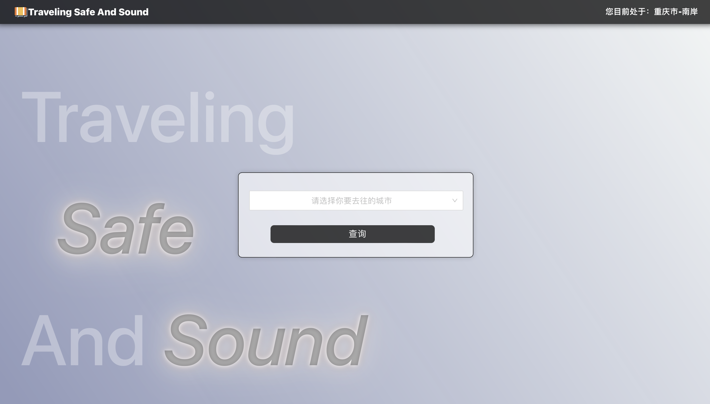
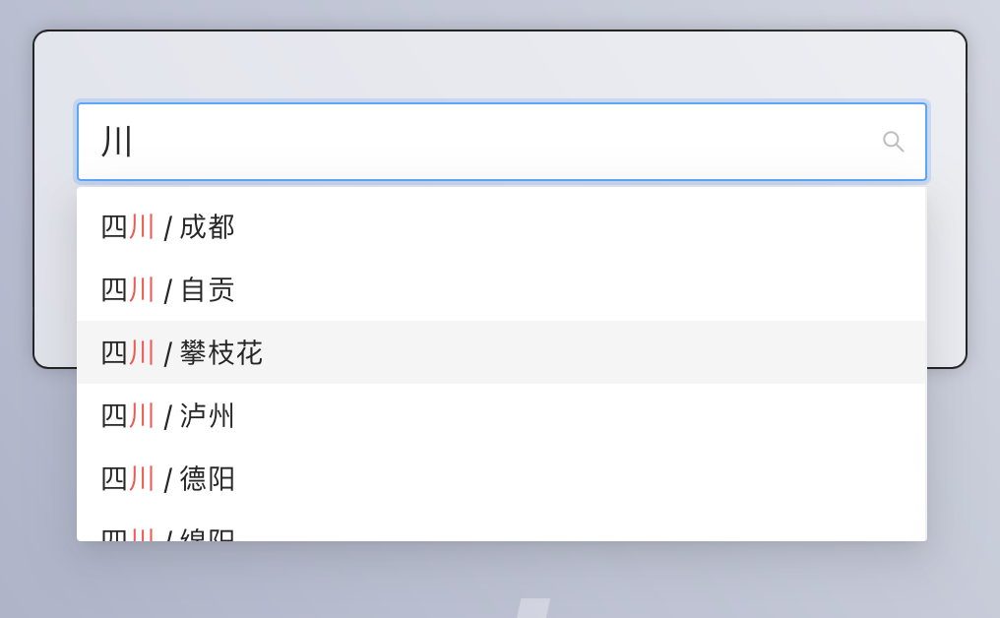
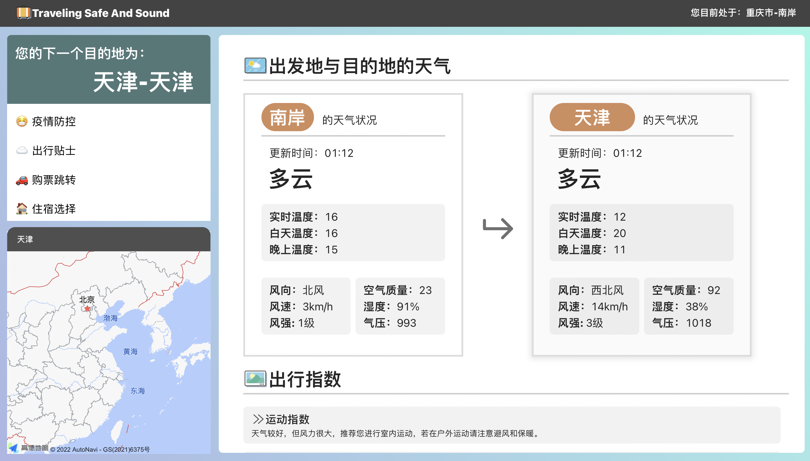
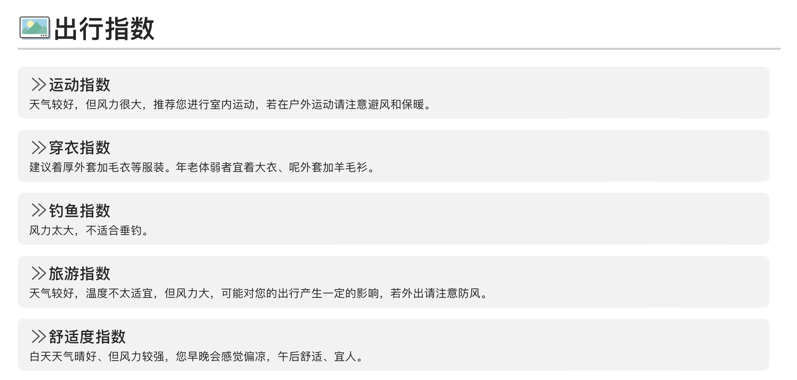
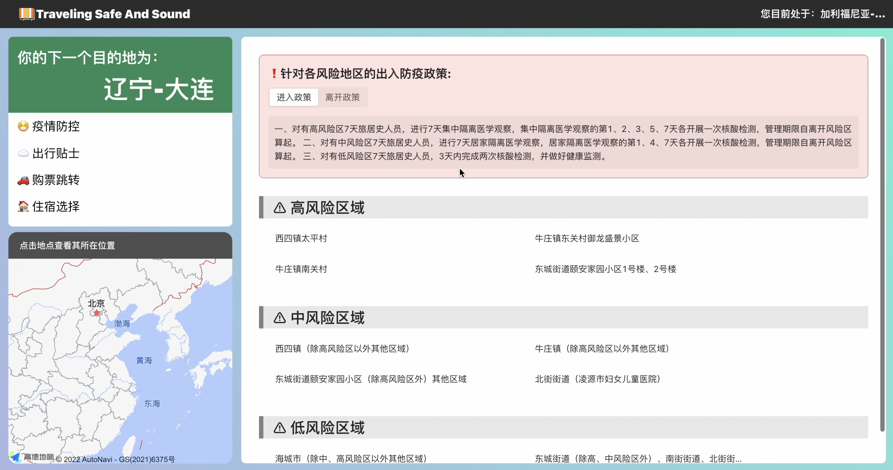

# 🧳 Traveling Safe And Sound - WebPC

> 出行出差几乎是每个人都会经历的事情，前往一个陌生地方前我们往往需要在各种渠道查询不同的信息，例如天气，交通，住宿，购票等，我们需要跳转到不同app，查询不同平台才能完成信息整合，而疫情改变了当下所有人的生活，各地疫情信息查询渠道不一致，不加注意就会因为不了解外出疫情政策而破坏了出差出行计划，带来了不小的经济与时间损失。

在此社会环境下，我们基于市场调研开发了一款面向出差出行人士的出行手册，为这类人群提供一个方便，快捷，一站式的出行查询，避免了因多方查询而带来的时间浪费与信息疏忽。

## 🎯 解决用户痛点

外地出行需要提前做好天气住宿等查询工作，本就要跳转多个app才能实现，而当前疫情形势与各地不同的查询渠道更使得查询工作变得繁琐复杂查询。

## 🧩 实现功能

#### 「列表选择搜索/输入搜索」

**首页展示：**

包含导航栏以及搜索框，获取用户当前位置信息。

**列表选择展示：**

提供用户根据省份进行级联选择。

**输入搜索展示：**

#### 「搜索目的地防疫政策查询/风险区域定位」

**政策查询/风险地区定位：**

用户可以通过按钮切换目的地出入政策，通过点击风险区域（包括高风险区域、中风险区域、低风险区域等），在左侧获得区域地图展示。

#### 「搜索目的地天气状况查询/生活指数推荐」

**天气查询/生活指数：**

对比当地与目的地的天气状况（包括天气类型、温度、空气质量等），并根据出行指数（共10种）给出相关建议。

#### 「搜索目的地购票索引/住宿推荐」

根据用户自己的倾向，选择不同的购票平台实现🔗链接跳转。